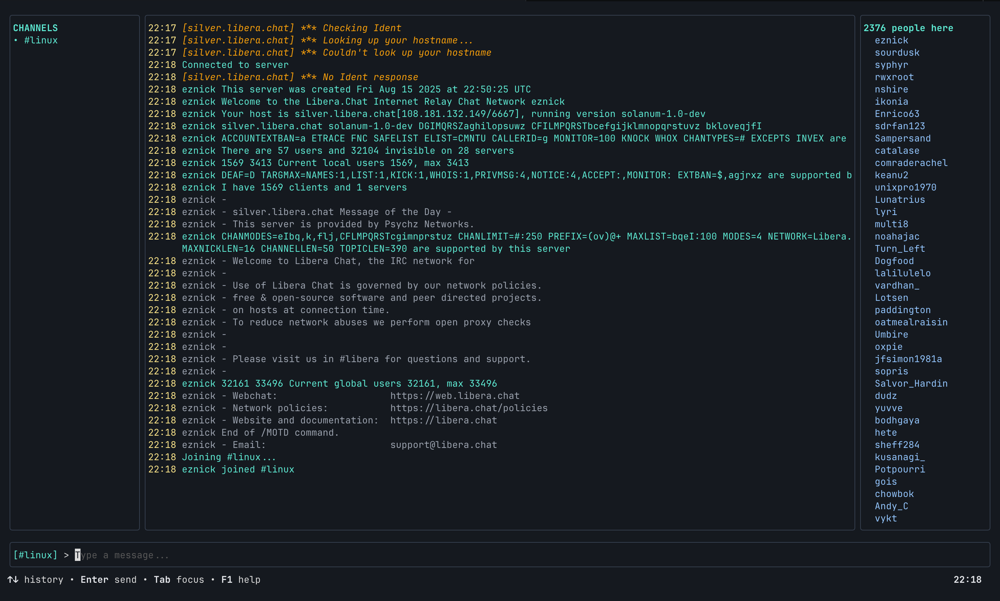

# IRC Client

A simple, lightweight **terminal-based IRC client** built with Go and Bubble Tea.



---

## Quick Start

Build and run the IRC client:

```sh
irc-client irc.libera.chat/6697 myusername
```

---

## Features

- IRC TUI with mouse and keyboard navigation
- Multi Channel Unified Chat
- Send and receive private messages
- Command history (up/down arrows)
- Auto-reconnect with TLS fallback
- Debug mode for troubleshooting (`-v` flag)

---

## Usage

### IRC Commands

| Command | Description |
|---------|-------------|
| `/join <channel>` | Join a channel |
| `/part` | Leave current channel |
| `/msg <nick> <message>` | Send private message |
| `/list` | List all channels on server |
| `/quit` | Disconnect from server |

### Navigation

| Key | Action |
|-----|--------|
| `Tab` | Cycle focus (Input → Channels → Chat → Users) |
| `Esc` | Return focus to input |
| `↑/↓` or `j/k` | Scroll chat or navigate channels/users |
| `PgUp/PgDn` or `b/f` | Scroll chat by page |
| `Home/End` or `g/G` | Jump to top/bottom of chat |
| `Enter` | Send message or switch to selected channel |
| `F1` | Toggle help screen |
| `Ctrl+C` | Quit application |

---

## Development

### Prerequisites

- Go 1.21 or higher
- Terminal with mouse support (recommended)

### Building

```sh
go build -o irc-client .
```

### Project Structure

- `main.go` - UI, event handling, and IRC event handlers
- `irc.go` - IRC protocol implementation and connection management

### LICENSE

[MIT](LICENSE)
